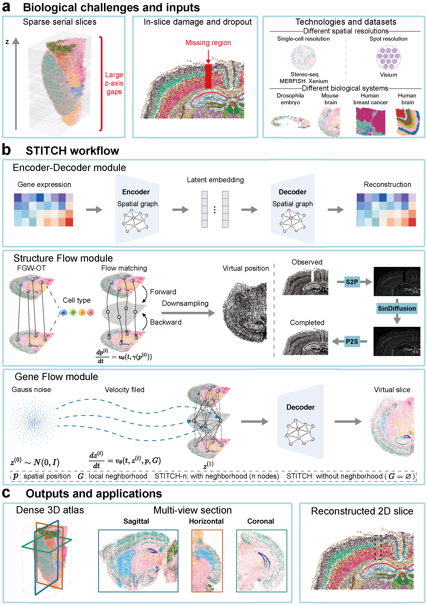

<div align="center">

# STITCH

### **S**patial **T**ranscriptomics **I**mputation via flow ma**TCH**ing

**A scalable generative framework for multidimensional virtual spatial transcriptomics reconstruction.**

[](https://opensource.org/licenses/MIT)
[](https://www.biorxiv.org/content/early/2026/06/06/2026.06.03.729557)
[](https://github.com/WANG-SUI/STITCH/stargazers)

</div>

---

<p align="center">
  
</p>

## 🔬 Overview

**STITCH** reconstructs missing spatial transcriptomics data from sparse 3D tissue sections or damaged 2D slices.

Unlike methods that require external reference atlases or matched histological image priors, STITCH learns intrinsic spatial-transcriptomic patterns directly from the observed tissue sample. It uses a decoupled generative design that separates spatial morphology restoration from transcriptomic generation, enabling scalable reconstruction across diverse spatial transcriptomics platforms.

## ✨ Highlights

- 🧩 **Multidimensional reconstruction** for both 3D cross-slice gaps and 2D in-slice tissue damage.
- 🧠 **Internal learning paradigm** without external atlas priors or matched histological images.
- 🔀 **Decoupled architecture** separating spatial coordinate reconstruction and gene expression generation.
- ⚡ **Point-wise Gene Flow** with linear computational complexity for scalable transcriptomic generation.
- 🧬 **Cross-platform compatibility** across single-cell and spot-level spatial transcriptomics datasets.
- 🚀 **Million-cell-scale atlas reconstruction** on a single commodity GPU.

## 🧱 Framework

STITCH consists of three core modules:

| Module | Role |
|---|---|
| **Encoder-Decoder** | Compresses high-dimensional gene expression into a topology-preserving latent space |
| **Structure Flow** | Reconstructs missing spatial coordinates for 3D gaps and 2D damaged regions |
| **Gene Flow** | Generates transcriptomic profiles at reconstructed spatial locations |

The default STITCH framework uses a point-wise Gene Flow design for scalability. We also provide a neighborhood-enhanced variant, **STITCH-n**, to evaluate the effect of local spatial neighborhoods on generative fidelity and computational cost.

## 📊 Applications

STITCH supports:

- **3D virtual slice reconstruction**
- **2D damaged tissue repair**
- **Continuous spatial atlas generation**
- **Single-cell and spot-level spatial transcriptomics reconstruction**

In our large-scale MERFISH mouse brain experiment, STITCH expands **54 observed slices** into a continuous atlas of **571 slices** and more than **11 million cells** within approximately **5 hours** on a single commodity GPU.

## 🧪 Evaluated datasets

| Platform | Dataset | Task |
|---|---|---|
| **Stereo-seq** | Drosophila embryo | 3D cross-slice reconstruction |
| **MERFISH** | Mouse brain | Large-scale 3D atlas reconstruction |
| **Xenium** | Mouse brain | 2D in-slice repair |
| **Visium** | Human BRCA | Spot-level 3D reconstruction |
| **Visium** | Human DLPFC | Spot-level 3D reconstruction |

## 📦 Data availability

The datasets used in our paper are available from the following public resources:

- **Stereo-seq Drosophila:** [Spateo Repository](https://spateo-release.readthedocs.io/en/latest/) and [direct data link](https://www.dropbox.com/s/bvstb3en5kc6wui/E7-9h_cellbin_tdr_v2.h5ad?dl=1)
- **MERFISH Mouse Brain:** [Allen Brain Cell Atlas](https://alleninstitute.github.io/abc_atlas_access/descriptions/Zhuang-ABCA-2.html)
- **Visium BRCA and DLPFC:** [So3D Database](https://So3D.bio-database.com/download.jsp)
- **Xenium 2D Mouse Brain:** [10x Genomics Portal](https://www.10xgenomics.com/datasets/fresh-frozen-mouse-brain-for-xenium-explorer-demo-1-standard)

## 💻 Code availability

The full source code, examples, and reproducibility instructions will be released upon publication.

## 📖 Citation

If you find STITCH useful for your research, please cite:

```bibtex
@article{Wang2026STITCH,
  title = {STITCH: Spatial Transcriptomics Imputation via Flow Matching with Internal Learning},
  author = {Wang, Sui and Wang, Xinyu and Peng, Qiangwei and Li, Tiejun},
  journal = {bioRxiv},
  year = {2026},
  doi = {10.64898/2026.06.03.729557},
  url = {https://www.biorxiv.org/content/early/2026/06/06/2026.06.03.729557}
}
```
